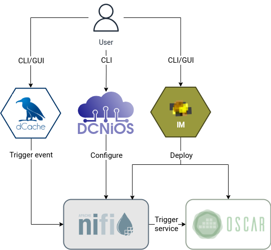
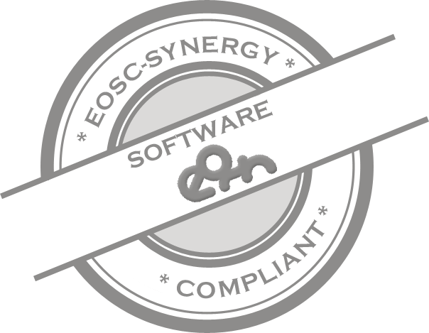
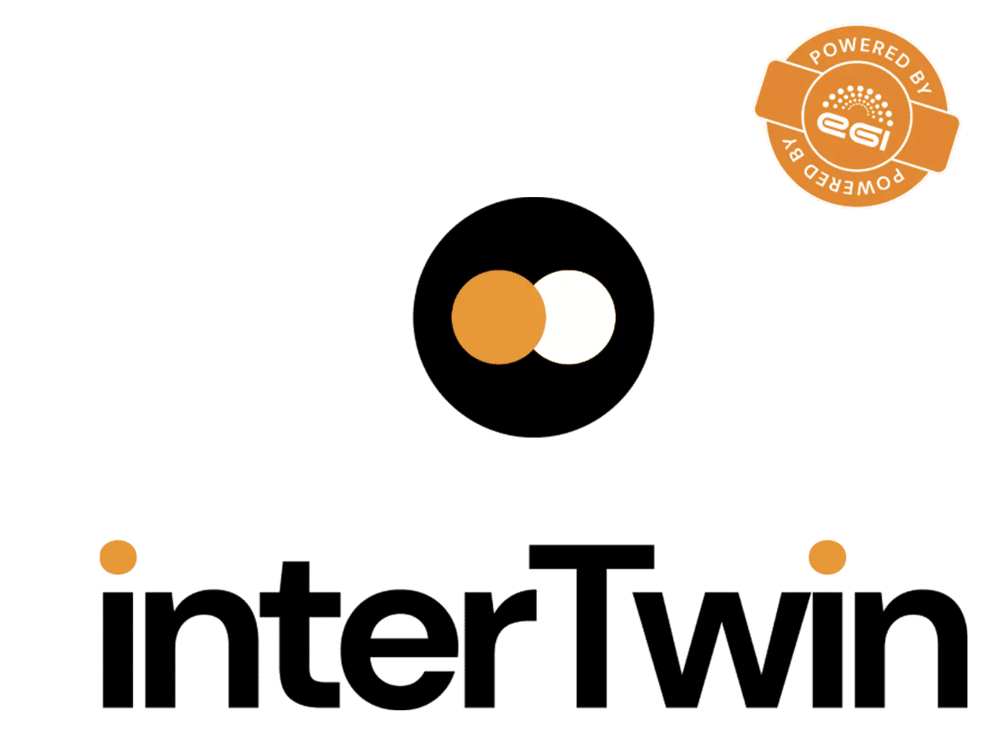

# DCNiOS


[DCNiOS](https://intertwin-eu.github.io/dcnios) is an open-source command-line tool to easily manage the creation of event-driven data processing flows. DCNiOS, Data Connector through Apache NiFi for OSCAR, facilitates the creation of event-driven processor connecting a Storage System like [dCache](http://dcache.org) or [Amazon S3](https://aws.amazon.com/s3) to a scalable OSCAR cluster by employing predefined dataflows that are processed by Apache NiFi.

[Apache NiFi](http://nifi.apache.org) is a reliable system to process and distribute data through powerful and scalable directed graphs of data routing, transformation, and system mediation logic.

[OSCAR](https://oscar.grycap.net) is an open-source platform for serverless event-driven data processing of containerized applications across the computing continuum.

The DCNiOS command-line interface allows you to create a NiFi dataflow though a YAML file (see figure).

After creating a dataflow using DCNiOS, when an event is captured (e.g., Server-sent event by dCache), Apache NiFi stores it in an internal queue and then sends it for processing to an OSCAR cluster at a customized rate. In the OSCAR cluster, a user-defined service creates a job to process the stored data.



Therefore, DCNiOS has been made to interact with NiFi and deploy a complete dataflow. It uses HTTP calls to communicate with a Nifi cluster. 

Apache NiFi can be automatically deployed using the [Infrastructure Manager (IM)](https://im.egi.eu) on a dynamically provisioned Kubernetes Cluster. **Note** that a NiFi registry is not required.

## Achievements

<a href="https://eu.badgr.com/public/assertions/0vLlQBANQzyHMOrmcsck3w?identity__url=https:%2F%2Fgithub.com%2FEOSC-synergy%2Foscar.assess.sqaaas%2Fcommit%2F10254d15a9230f45c84dae22f3711653162faf78">
</a>

This software has received a silver badge according to the [Software Quality Baseline criteria](https://www.eosc-synergy.eu/for-developers/) defined by the [EOSC-Synergy](https://www.eosc-synergy.eu) project.

<!--Please acknowledge the use of DCNiOS by citing the following scientific
publications ([preprints available]())-->

## Getting Started

### Prerequisites

- OSCAR cluster with services deployed.
- NiFi Cluster deployed.
- A Python distribution such as [Anaconda](https://www.anaconda.com/).

### Installation

#### Recommended
Create an environment with conda and activate it.

``` bash
conda create --name dcnios python=3.7.6
conda activate dcnios
```

Install all the requirements defined in `requirements.txt`

``` bash
pip install -r requeriments.txt
```
#### Minimum
Install the minimum requirements for DCNiOS:


``` bash
pip install pyyaml==6.0 requests==2.28.2 oscar_python==1.0.3
```

## Authors

- Germán Moltó mailto:gmolto@dsic.upv.es
- Estíbaliz Parcero mailto:esparig@i3m.upv.es
- Sergio Langarita mailto:slangarita@i3m.upv.es

Instituto de Instrumentación para Imagen Molecular (I3M), Centro Mixto CSIC — Universitat Politècnica de València, Camino de Vera s/n, 46022 Valencia, España.


## Versions and Maintenance

There is only one version in maintenance:
- The main branch in the source code repository maintains a working state version of the software component.
- Documentation is updated with the new software versions involving any substantial or minimal change in the application's behavior. Any issue can be reported in the [Issues section of the GitHub project](https://github.com/interTwin-eu/dcnios/issues).
- Documentation is updated whenever reported as inaccurate or unclear.

## Licensing

DCNiOS is licensed under the Apache License, Version 2.0. See LICENSE for the full license text.

## Acknowledgements



This work was supported by the project “An interdisciplinary Digital Twin Engine for science’’ (interTwin), which has received funding from the European Union’s Horizon Europe Programme under Grant 101058386.

## More information

You can find more [information](https://oscar.grycap.net/blog/data-driven-processing-with-dcache-nifi-oscar/ ) in the [OSCAR's blog.](https://oscar.grycap.net/blog/)
