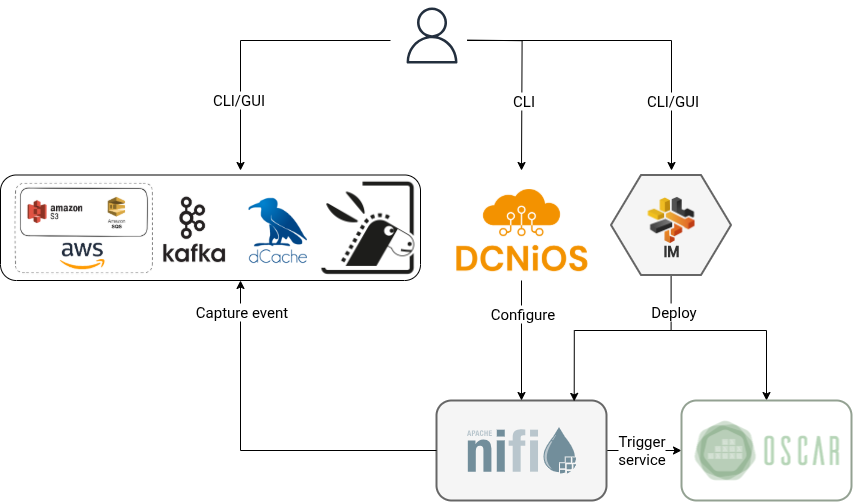

# DCNiOS


DCNiOS is an open-source command-line tool to easily manage the creation of event-driven data processing flows. DCNiOS, Data Connector through Apache NiFi for OSCAR, facilitates the creation of event-driven processes connecting a Storage System like [dCache](http://dcache.org) or [S3](https://aws.amazon.com/s3) to a scalable OSCAR cluster by employing predefined dataflows that are processed by Apache NiFi.

[Apache NiFi](http://nifi.apache.org) is a reliable system to process and distribute data through powerful and scalable directed graphs of data routing, transformation, and system mediation logic.

[OSCAR](https://oscar.grycap.net) is an open-source platform for serverless event-driven data processing of containerized applications across the computing continuum.

Together with [DCNiOS](http://github.com/grycap/dcnios) ( NiFi + OSCAR), you can manage the creation of event-driven data processing flows. As shown in the figure, when an event occurs in the external component, dCache in this case, events are ingested in Apache NiFi, which can queue them up depending on the (modifiable at runtime) ingestion rate, to be then delegated for processing into a scalable OSCAR cluster, where a user-defined application based on a Docker image can process the data file.

</left>

Therefore, DCNiOS has been made to interact with NiFi and deploy a complete dataflow. It uses HTTP calls to communicate with a Nifi cluster, which can be automatically deployed by the [Infrastructure Manager (IM)](https://im.egi.eu). Apache NiFi is deployed on a dynamically provisioned Kubernetes. It does not require a Nifi registry.

All the dataflow information is described in a YAML file, and by executing the DCNiOS command-line interface, this dataflow is deployed on Nifi.

From predefined recipes (ProcessGroup in Nifi, .json files) created before, DCNiOS inserts a general flow and changes the variables to create a concrete workflow.


## Getting Started

### Prerequisites

- OSCAR cluster with services deployed
- Nifi Cluster deployed
- A package provider such as [Anaconda](https://www.anaconda.com/)

### Installation

Create an environment with conda and use it.

``` bash
conda create --name dcnios python=3.7.6
conda activate dcnios
```

Install all the requirements defined in `requirements.txt`

``` bash
pip install -r requeriments.txt
```

Or only install the minimal requirements that DCNiOS needs.


``` bash
pip install pyyaml==6.0 requests==2.28.2 oscar_python==1.0.3
```

## Authors

- Germán Moltó mailto:gmolto@dsic.upv.es
- Estibaliz Parcero mailto:esparig@i3m.upv.es
- Sergio Langarita mailto:slangarita@i3m.upv.es

Instituto de Instrumentación para Imagen Molecular (I3M), Centro Mixto CSIC — Universitat Politècnica de València, Camino de Vera s/n, 46022 Valencia, España


## Versions and Maintenance

There is only one version in maintenance:
- The main branch in the source code repository maintains a working state version of the software component.
- Documentation is updated with the new software versions involving any substantial or minimal change in the application's behavior. Any issue can be reported in the [Issues section of the GitHub project](https://github.com/interTwin-eu/dcnios/issues)
- Documentation is updated whenever reported as inaccurate or unclear.

## Licensing

DCNiOS is licensed under the Apache License, Version 2.0. See LICENSE for the full license text.

## Acknowledgements

This work was supported by the project “An interdisciplinary Digital Twin Engine for science’’ (interTwin), which has received funding from the European Union’s Horizon Europe Programme under Grant 101058386.


## More information

You can find more [information](https://oscar.grycap.net/blog/data-driven-processing-with-dcache-nifi-oscar/ ) in the [OSCAR's blog.](https://oscar.grycap.net/blog/)


<a href="https://eu.badgr.com/public/assertions/0vLlQBANQzyHMOrmcsck3w?identity__url=https:%2F%2Fgithub.com%2FEOSC-synergy%2Foscar.assess.sqaaas%2Fcommit%2F10254d15a9230f45c84dae22f3711653162faf78">
    
</a>

This software has received a silver badge according to the [Software Quality Baseline criteria](https://www.eosc-synergy.eu/for-developers/) defined by the [EOSC-Synergy](https://www.eosc-synergy.eu) project. Please acknowledge the use of DCNiOS by citing the following scientific
publications ([preprints available](https://www.grycap.upv.es/gmolto/publications)):